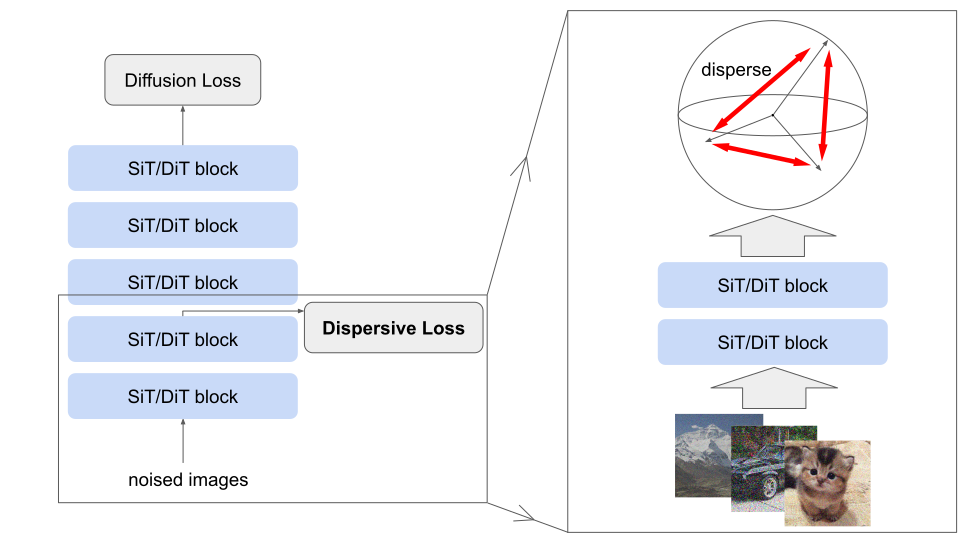

# Dispersive Loss

This repo contains the official PyTorch implementation of Dispersive Loss.

> [**Diffuse and Disperse: Image Generation with Representation Regularization**](https://arxiv.org/abs/2506.09027)<br>
> [Runqian Wang](https://raywang4.github.io/), [Kaiming He](https://people.csail.mit.edu/kaiming/)
> <br>MIT<br>

We propose Dispersive Loss, a simple plug-and-play regularizer that effectively improves diffusion-based generative models. 
Our loss function encourages internal representations to disperse in the hidden space, analogous to contrastive self-supervised learning, with the key distinction that it requires no positive sample pairs and therefore does not interfere with the sampling process used for regression.

We implement our Dispersive Loss on top of [SiT](https://github.com/willisma/SiT) codebase. The core implementation of Dispersive Loss is highlighted below:
```python
def disp_loss(self, z): # Dispersive Loss implementation (InfoNCE-L2 variant)
  z = z.reshape((z.shape[0],-1)) # flatten
  diff = th.nn.functional.pdist(z).pow(2)/z.shape[1] # pairwise distance
  diff = th.concat((diff, diff, th.zeros(z.shape[0]).cuda()))  # match JAX implementation of full BxB matrix
  return th.log(th.exp(-diff).mean()) # calculate loss
```

## Setup

Run the following script to setup environment.

```bash
git clone https://github.com/raywang4/DispLoss.git
cd DispLoss
conda env create -f environment.yml
conda activate SiT
```


## Training With Dispersive Loss

To train with Dispersive Loss, simply add the `--disp` argument to the training script:

```bash
torchrun --nnodes=1 --nproc_per_node=N train.py --model SiT-XL/2 --data-path /path/to/imagenet/train --disp
```

**Logging.** To enable `wandb`, firstly set `WANDB_KEY`, `ENTITY`, and `PROJECT` as environment variables:

```bash
export WANDB_KEY="key"
export ENTITY="entity name"
export PROJECT="project name"
```
Then in training command add the `--wandb` flag:

```bash
torchrun --nnodes=1 --nproc_per_node=N train.py --model SiT-XL/2 --data-path /path/to/imagenet/train --disp --wandb
```
**Resume training.** To resume training from custom checkpoint:

```bash
torchrun --nnodes=1 --nproc_per_node=N train.py --model SiT-L/2 --data-path /path/to/imagenet/train --disp --ckpt /path/to/model.pt
```

## Sampling

**Pre-trained checkpoints.** We provide a [SiT-B/2 checkpoint](https://drive.google.com/file/d/18OeryruY-P4KuqJeKB6_EXtHUkQ5Cy7u/view?usp=sharing) and a [SiT-XL/2 checkpoint](https://drive.google.com/file/d/1NR_R6wYXS6dwCwYCM8h8EmeLpJjtiwVr/view?usp=sharing) both trained with Dispersive Loss for 80 epochs on ImageNet 256x256.

**Sampling from checkpoint.** To sample from the EMA weights of a 256x256 SiT-XL/2 model checkpoint with ODE sampler, run:
```bash
python sample.py ODE --model SiT-XL/2 --image-size 256 --ckpt /path/to/model.pt
```
**More sampling options.** For more sampling options such as SDE sampling, please refer to [`train_utils.py`](train_utils.py).

## Evaluation

The [`sample_ddp.py`](sample_ddp.py) script samples a large number of images from a pre-trained model in parallel. This script 
generates a folder of samples as well as a `.npz` file which can be directly used with [ADM's TensorFlow
evaluation suite](https://github.com/openai/guided-diffusion/tree/main/evaluations) to compute FID, Inception Score and
other metrics. To sample 50K images from a pre-trained SiT-XL/2 model over `N` GPUs under default ODE sampler settings, run:

```bash
torchrun --nnodes=1 --nproc_per_node=N sample_ddp.py ODE --model SiT-XL/2 --num-fid-samples 50000 --ckpt /path/to/model.pt
```

## Differences from JAX
Our original implementation is in JAX, and this repo contains our re-implementation in PyTorch. 
Therefore, results from running this repo may have minor numerical differences with those reported in our paper. 
In our JAX experiments, we used 16 devices with local batch size 16, whereas in PyTorch experiments we used 8 devices with local batch size 32.
We have adjusted the hyperparameter choices slightly for best performance. 
We report our reproduction results below.
| implementation | config | local bz | B/2 80 ep | XL/2 80 ep (cfg=1.5) |
|-|:-:|:-:|:-:|:-:|
| baseline | - | 16 | 36.49 | 6.02  |
| JAX | $\lambda$=0.5, $\tau$=0.5, depth=num_layers//4 | 16 | 32.35 | 5.09  |
| PyTorch | $\lambda$=0.25, $\tau$=1, depth=num_layers | 32 | 32.64 | 4.74 |


## License
This project is under the MIT license. See [LICENSE](LICENSE.txt) for details.


